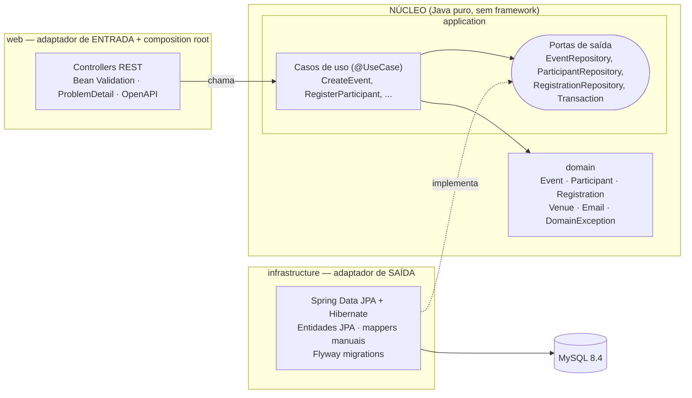

# java-spring-clean-events

[](https://github.com/andreccls/java-spring-clean-events/actions/workflows/ci.yml)
[](https://adoptium.net/)
[](https://spring.io/projects/spring-boot)
[](LICENSE)
[](#cobertura)

> ⚠️ **PROJETO DE EXEMPLO DE CÓDIGO (reference / sample) — NÃO É UM PRODUTO PRONTO PARA PRODUÇÃO.**
> Existe para demonstrar **Clean Architecture** com Java + Spring Boot, testes e documentação. **Não tem
> autenticação/autorização**, rate limiting, observabilidade avançada nem hardening. Não o publique na internet como está.
> A lista honesta do que falta está em [Limitações conhecidas](#limitações-conhecidas-e-próximos-passos).

> 🇬🇧 Short English summary at the [end of this file](#english-summary) (and in [README.en.md](README.en.md)).

Sistema de **eventos** (eventos, participantes e inscrições) em **Java 21 + Spring Boot 3.5**, organizado em
**Clean Architecture** com **módulos Maven separados** — o compilador (e o ArchUnit) impõem a regra de dependência.
`domain` e `application` são Java puro (zero Spring, zero JPA) e têm **100 % de cobertura de linhas e branches como
gate que falha o build**.

Serve de **template**: o passo a passo para adicionar um novo caso de uso está em
[docs/ARCHITECTURE.md](docs/ARCHITECTURE.md#como-adicionar-um-novo-caso-de-uso-passo-a-passo).

Desenhado seguindo **SOLID, KISS e YAGNI** — por isso **não** tem CQRS completo, event sourcing, MapStruct, Lombok
nem mediador; cada escolha está num [ADR](docs/adr).

## Arquitetura



**Regra de dependência** — as setas de código apontam sempre para dentro, e isso é verificado em **dois** níveis
(o grafo de módulos Maven não compila de outro jeito; `ArchitectureTest` com ArchUnit pega vazamentos de framework):

```
web ─────────────► application ─────► domain          (domain: zero dependências)
web ─► infrastructure ─► application ─► domain
```

`web` referencia `infrastructure` **somente** em `EventsApplication` (*composition root*).

## Estrutura de pastas

```
.
├── pom.xml                         # parent: versões, JaCoCo (agente + relatório)
├── domain/                         # POJOs/records: Event, Participant, Registration, Venue, Email, exceções
│   └── src/{main,test}/java/com/andrecoura/events/domain/{event,participant,registration,shared}
├── application/                    # casos de uso + portas + DTOs de saída (depende só de domain)
│   └── src/.../application/{event,participant,registration,port,common}
├── infrastructure/                 # JPA + Flyway: entidades JPA, mappers, adaptadores das portas
│   └── src/main/resources/db/migration/V1__create_schema.sql
├── web/                            # controllers REST, tratamento de erros, composition root, ArchUnit
├── docs/ (ARCHITECTURE.md, adr/)   scripts/coverage-summary.sh
└── Makefile  Dockerfile  docker-compose.yml  .env.example  .github/workflows/ci.yml
```

## Como rodar

Pré-requisito: **Docker**. (JDK 21 + Maven locais são opcionais: sem eles, o `Makefile` usa a imagem
`maven:3.9-eclipse-temurin-21`, com o cache do `~/.m2` num volume Docker.)

```bash
make up                 # sobe MySQL 8.4 + API (migrations Flyway aplicadas na partida)
# Swagger UI:  http://localhost:8090/swagger-ui.html      Health: http://localhost:8090/actuator/health
make down               # para tudo (mantém o volume do banco)
```

> **Portas:** a API usa `8090` e o MySQL `3316` no host (de propósito, para **não** colidir com um MySQL local em
> `3306`). Para mudar, copie `.env.example` para `.env` e edite `API_PORT` / `MYSQL_PORT`.
> As senhas do `docker-compose.yml`/`.env.example` são **apenas para desenvolvimento**.

Exemplo completo (evento → participantes → inscrições, incluindo os erros de regra):

```bash
H='Content-Type: application/json'
API=http://localhost:8090

EVENT=$(curl -s -H "$H" $API/events -d '{
  "title":"Java Meetup","description":"Talks","venue":{"name":"Main Hall","address":"1 Example St"},
  "startsAt":"2030-05-10T18:00:00Z","endsAt":"2030-05-10T21:00:00Z","capacity":1}' | jq -r .id)
curl -s -X POST $API/events/$EVENT/publish                      # DRAFT -> PUBLISHED

MARIA=$(curl -s -H "$H" $API/participants -d '{"name":"Maria Silva","email":"maria@example.com"}' | jq -r .id)
JOAO=$(curl -s -H "$H" $API/participants -d '{"name":"Joao Souza","email":"joao@example.com"}' | jq -r .id)

SEAT=$(curl -s -H "$H" $API/events/$EVENT/registrations -d "{\"participantId\":\"$MARIA\"}" | jq -r .id)  # 201
curl -s -H "$H" $API/events/$EVENT/registrations -d "{\"participantId\":\"$MARIA\"}"   # 409 já inscrito
curl -s -H "$H" $API/events/$EVENT/registrations -d "{\"participantId\":\"$JOAO\"}"    # 409 evento lotado
curl -s -X POST $API/registrations/$SEAT/cancel                                         # libera a vaga
curl -s -H "$H" $API/events/$EVENT/registrations -d "{\"participantId\":\"$JOAO\"}"    # 201
```

> A data do evento precisa ser **futura** no momento do `publish`; ajuste `startsAt`/`endsAt` se a data acima já passou.

Erros seguem RFC 7807 (`application/problem+json`): `400` entrada inválida ou regra de negócio (com a lista `errors`
por campo quando é validação), `404` não encontrado, `409` conflito de estado (lotado, e-mail duplicado, evento
cancelado...), `500` genérico sem vazar detalhes.

## Endpoints

| Recurso | Método e rota | Descrição | Respostas |
|---|---|---|---|
| Events | `POST /events` | Cria evento em `DRAFT` | 201 · 400 |
| | `GET /events?status=&from=&to=&page=&pageSize=` | Lista paginada; `status` (enum), `from` (inclusivo) e `to` (exclusivo) ISO-8601 sobre o início | 200 · 400 |
| | `GET /events/{id}` | Consulta | 200 · 404 |
| | `PUT /events/{id}` | Substitui os dados (não aceita `CANCELLED`/`FINISHED`; capacidade ≥ inscrições ativas) | 200 · 400 · 404 · 409 |
| | `POST /events/{id}/publish` | `DRAFT → PUBLISHED` (data futura e capacidade > 0) | 200 · 400 · 404 · 409 |
| | `POST /events/{id}/cancel` | `DRAFT/PUBLISHED → CANCELLED` | 200 · 404 · 409 |
| | `POST /events/{id}/finish` | `PUBLISHED → FINISHED` | 200 · 404 · 409 |
| | `DELETE /events/{id}` | Remove (somente `DRAFT`) | 204 · 404 · 409 |
| Participants | `POST /participants` | Cria participante (e-mail único, normalizado em minúsculas) | 201 · 400 · 409 |
| | `GET /participants?page=&pageSize=` | Lista paginada | 200 |
| | `GET /participants/{id}` | Consulta | 200 · 404 |
| | `PUT /participants/{id}` | Atualiza nome/e-mail | 200 · 400 · 404 · 409 |
| | `DELETE /participants/{id}` | Remove (bloqueado se tiver inscrições) | 204 · 404 · 409 |
| Registrations | `POST /events/{id}/registrations` | Inscreve `{"participantId": "..."}` | 201 · 400 · 404 · 409 |
| | `GET /events/{id}/registrations?page=&pageSize=` | Lista inscrições (inclui canceladas) | 200 · 404 |
| | `POST /registrations/{id}/cancel` | Cancela a inscrição e **libera a vaga** | 200 · 404 · 409 |
| Plataforma | `GET /actuator/health` · `GET /v3/api-docs` · `GET /swagger-ui.html` | Saúde (inclui MySQL), OpenAPI, Swagger UI | 200 |

Paginação: `page` ≥ 1 (padrão 1), `pageSize` 1–100 (padrão 20); valores fora da faixa são ajustados, não rejeitados.

### Regras de negócio principais

- **Event** (no domínio): `fim > início`; título obrigatório; capacidade ≥ 0 em rascunho, mas **publicar exige data futura e
  capacidade > 0**; `CANCELLED`/`FINISHED` não podem ser alterados; transições `DRAFT → PUBLISHED → FINISHED` e
  `DRAFT/PUBLISHED → CANCELLED`.
- **Registration**: só em evento `PUBLISHED`; nunca excede a capacidade; **um participante (um e-mail) tem no máximo uma
  inscrição ativa por evento**; cancelar libera a vaga (o registro fica como histórico) e permite se inscrever de novo.
- **Concorrência**: inscrições simultâneas não ultrapassam a capacidade (lock da linha do evento) — há teste provando
  (`ConcurrentRegistrationIT`).

## Testes

```bash
make test-unit   # só unitários (domain + application + ArchUnit); NÃO precisa de banco
make test        # TUDO: unitários + integração (sobe o MySQL sozinho) + gate de 100 %
make coverage    # idem + imprime a tabela de cobertura por módulo; relatório HTML em <módulo>/target/site/jacoco/index.html
```

Funciona **sem JDK/Maven instalados** (usa `docker compose run maven`) e **com JDK/Maven locais** (usa `mvn` direto; o MySQL
continua vindo do compose). Os testes de integração leem `TEST_MYSQL_URL` / `TEST_MYSQL_PASSWORD` (o `Makefile`, o
compose e o CI já os definem) e recriam o schema com as migrations reais a cada execução.
Para rodar na mão: `make up-db` e depois
`TEST_MYSQL_URL='jdbc:mysql://127.0.0.1:3316/events_test?createDatabaseIfNotExist=true' TEST_MYSQL_PASSWORD=dev_only_root_password mvn verify`.

### Testes unitários

Os testes unitários fazem parte da documentação: cada classe de teste descreve, em linguagem de domínio, uma regra
do sistema (`requiresPositiveCapacity`, `refusesWhenFullAndAcceptsAgainAfterACancellation`...). Ler os testes é a forma
mais rápida de entender o que o sistema garante.

**Estratégia.** Pirâmide: muitos testes rápidos e isolados onde estão as regras (núcleo), poucos e realistas nas bordas.

| Nível | Módulo / classes | O que testa | Como | Meta |
|---|---|---|---|---|
| **Unitário de domínio** | `domain` — `EventTest`, `RegistrationTest`, `ParticipantTest`, `EmailTest`, `VenueTest` | Invariantes e máquina de estados: fim > início, publicar exige data futura e capacidade > 0, imutabilidade de evento cancelado/finalizado, regra de vaga (`ensureCanRegister`), normalização de e-mail | JUnit 5 + AssertJ **puros** (sem Spring, sem mock). Escritos em **TDD** — o teste vermelho (nem compilava) veio antes do código | **100 % linhas e branches — gate** |
| **Unitário de aplicação** | `application` — `EventUseCasesTest`, `ParticipantUseCasesTest`, `RegistrationUseCasesTest`, `PagingTest` | **Orquestração** dos casos de uso: 404 quando não existe, unicidade de e-mail, duplicidade de inscrição, evento lotado, cancelamento libera vaga, não reduzir capacidade abaixo das inscrições ativas, filtros/paginação | **Fakes em memória** das portas (`InMemory*Repository`, relógio fixo, `Transaction` direta) — sem Mockito: testes por estado, legíveis | **100 % linhas e branches — gate** |
| **Arquitetura** | `web` — `ArchitectureTest` (ArchUnit) | Regra de dependência: camadas só apontam para dentro; domain/application sem Spring/JPA/Jackson; controllers não tocam a infraestrutura; `@UseCase` só em `application` | ArchUnit sobre as classes compiladas | sempre verde |
| **Integração** (não unitário) | `infrastructure` — `*RepositoryIT`, `ConcurrentRegistrationIT` | Mapeamento JPA ↔ domínio, migrations Flyway, índices únicos, filtros/paginação SQL, **lock de capacidade sob concorrência** | MySQL **real** | só relatório |
| **Ponta a ponta HTTP** (não unitário) | `web` — `EventApiIT`, `ParticipantApiIT`, `RegistrationApiIT`, `PlatformIT` | Contrato REST completo: status codes, formato `ProblemDetail`, validação, OpenAPI, health | `MockMvc` + app completo + MySQL **real** | só relatório |

**Convenções.** `*Test` = unitário (roda no `surefire`, sem I/O); `*IT` = integração (roda no `failsafe`, precisa de MySQL).
Um teste, uma regra, com nome em forma de frase. Cada `throw` do núcleo tem pelo menos um teste que o exercita — é isso
que torna o gate de 100 % de **branches** alcançável sem truques.

**Como interpretar a cobertura.**

- *Linhas* respondem "este código rodou?"; *branches* respondem "os dois lados de cada `if`/ternário rodaram?". 100 % de
  branches em `domain`/`application` significa que **toda regra de negócio tem um teste para o caminho feliz e para o de
  violação**. Cobertura 100 % **não** prova ausência de bugs — prova que nada do núcleo ficou sem teste; a qualidade vem
  das asserções (por isso o estilo de nomes/asserções acima).
- **`domain` e `application` são o gate**: `mvn verify` falha se qualquer um cair abaixo de 100 % (regra `check` do JaCoCo,
  *por módulo*: cada camada é coberta pelos **seus próprios** testes, sem "emprestar" cobertura de outra).
- `infrastructure` e `web` são **só reportados**: seus números vêm dos testes de integração e servem para achar código
  não exercitado, não para travar o build. `web` mostra 94,6 % porque o handler genérico de `500` e o `main()` não são
  exercitados (ver abaixo).
- Para olhar linha a linha: abra `domain/target/site/jacoco/index.html` (ou `application/…`) após `make coverage`.

<a id="cobertura"></a>

### Cobertura (medida em 2026-10-06 com `make coverage`)

**124 testes, todos verdes**: Domain 44 · Application 38 · ArchUnit 5 · Integração Infrastructure 15 · API (MockMvc) 22.

| Módulo | Linhas | Branches | Política |
|---|---|---|---|
| `domain` | 127/127 = **100 %** | 42/42 = **100 %** | **gate** — falha o build abaixo de 100 % |
| `application` | 141/141 = **100 %** | 18/18 = **100 %** | **gate** — falha o build abaixo de 100 % |
| `infrastructure` | 71/71 = 100 % | — (sem branches) | só relatório (testes de integração) |
| `web` | 70/74 = 94,6 % | — (sem branches) | só relatório (testes de integração) |

Linhas não cobertas em `web` (4): o `@ExceptionHandler(Exception.class)` que devolve `500` genérico (nenhum teste provoca um erro
inesperado) e o `main()` da aplicação (`SpringApplication.run`); nenhuma é regra de negócio.

**Exclusões de cobertura: nenhuma.** O build não exclui classe nem linha alguma; os números acima são sobre todo o código
de produção. (Se uma exclusão for necessária um dia, deve entrar aqui com justificativa.)

## Princípios → onde estão aplicados

| Princípio | Onde no código |
|---|---|
| **S** — Responsabilidade única | Um caso de uso por classe (`RegisterParticipant`, `CancelRegistration`); `ApiExceptionHandler` é o único tradutor exceção→HTTP; cada entidade JPA só mapeia |
| **O** — Aberto/fechado | Novo caso de uso = nova classe com `@UseCase`; o `ApplicationConfig` o registra por varredura, sem editar nada existente. Novo adaptador = nova implementação da porta |
| **L** — Substituição de Liskov | `InMemory*Repository` (fakes em `application/src/test`) e `Jpa*Repository` são intercambiáveis atrás da mesma porta; os testes de caso de uso rodam com os fakes e o `ConcurrentRegistrationIT` roda os mesmos casos de uso com JPA |
| **I** — Segregação de interfaces | Portas pequenas: um repositório por agregado com só o que os casos de uso usam; `Transaction` com 1 método |
| **D** — Inversão de dependência | `application` **define** as portas; `infrastructure` as **implementa**; a ligação ocorre só no composition root. Provado por módulos Maven + ArchUnit |
| **YAGNI** | Sem lista de espera, sem CQRS, sem eventos de domínio, sem MapStruct/Lombok, sem repositório genérico, sem autenticação (ver "Próximos passos") |
| **KISS** | Casos de uso são classes com `execute(...)`; erros por exceção → `ProblemDetail`; DTOs são `record`s; mapeamento JPA↔domínio é um par de métodos |
| **DRY** | `Rules.require/requiredText` para invariantes; `PageRequest`/`Page` compartilhados; `Pages` traduz paginação em um só lugar |
| **DDD tático (leve)** | Agregados com fábricas estáticas (`create`/`restore`) e sem setters; value objects (`Venue`, `Email`) imutáveis e auto-validados; agregados se referenciam por id |

## Documentação

- [docs/ARCHITECTURE.md](docs/ARCHITECTURE.md) — camadas, fluxo de uma requisição, regra de dependência, concorrência e
  **como adicionar um novo caso de uso**.
- [docs/adr/](docs/adr) — decisões: [Clean Architecture em módulos Maven](docs/adr/0001-clean-architecture-maven-modules.md) ·
  [entidades JPA separadas + mappers manuais](docs/adr/0002-separate-jpa-entities-manual-mappers.md) ·
  [casos de uso como classes, sem mediador](docs/adr/0003-use-case-classes-no-mediator.md) ·
  [concorrência de vagas](docs/adr/0004-registration-concurrency.md) · [estratégia de testes](docs/adr/0005-testing-strategy.md).

## Limitações conhecidas e próximos passos

- **Sem autenticação/autorização** e sem *rate limiting*: qualquer um que alcance a API pode tudo. Próximo passo natural:
  Spring Security + OAuth2/JWT na camada `web`, sem tocar no núcleo.
- **Lista de espera** (waitlist) foi omitida (YAGNI): hoje, evento lotado responde `409`. O ponto natural é um novo
  status `WAITING` em `Registration` e um caso de uso que promove o primeiro da fila ao cancelar.
- **Cancelar um evento não cancela as inscrições** nem notifica ninguém (não há notificações/e-mail/eventos de domínio).
- **`finish` é manual**: nada marca o evento como `FINISHED` quando a data passa (um job agendado resolveria).
- **Participante é global**: o e-mail identifica a pessoa em todos os eventos; não há dono/organizador de evento.
- **Fuso horário**: datas trafegam e são salvas em UTC; não há conceito de fuso do local do evento.
- **Migrations na partida** (Flyway no `bootRun`) é conveniência de demo; em produção, rode como job separado.
- Swagger UI e `/v3/api-docs` ficam sempre ligados, e o `docker-compose.yml` usa o usuário `root` do MySQL com senha de
  desenvolvimento — ambos aceitáveis só para uma demo.
- Os testes de integração rodam contra MySQL via `docker compose` (não Testcontainers) — ver [ADR 0005](docs/adr/0005-testing-strategy.md).
- O modo "com JDK/Maven locais" do `Makefile` **não foi exercitado** no ambiente de desenvolvimento original (sem Java no
  Mac); a execução via Docker é a validada. O workflow de CI (`.github/workflows/ci.yml`) também ainda não rodou no GitHub.

## Licença

[MIT](LICENSE) © André Coura

<a id="english-summary"></a>

## English summary

> **Sample / reference code project — not production-ready** (no authentication, no hardening).

An events system (events, participants, registrations) in **Java 21 + Spring Boot 3.5**, built as **Clean Architecture** with
separate **Maven modules** (`domain` ← `application` ← `infrastructure`/`web`). Domain and application are plain Java and
covered 100 % (line and branch) by unit tests, enforced as a JaCoCo build gate; ArchUnit enforces the dependency rule;
infrastructure (JPA + MySQL + Flyway) and web (REST, RFC 7807 problem details, OpenAPI) are covered by integration tests
against a real MySQL. Run `make up` (Docker only) and open `http://localhost:8090/swagger-ui.html`; `make test` and
`make coverage` work with or without a local JDK. See [README.en.md](README.en.md) and
[docs/ARCHITECTURE.md](docs/ARCHITECTURE.md) (Portuguese).
