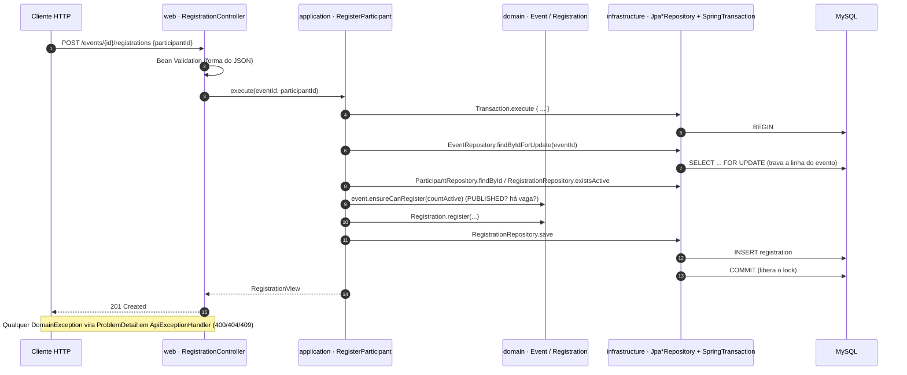

# Arquitetura

Este documento explica **como o código está organizado e por quê**, e termina com o passo a passo para usar o
projeto como **template** ao adicionar um novo caso de uso.

> Projeto de exemplo (reference/sample), não um produto pronto para produção — ver "Limitações" no [README](../README.md).

## 1. Visão geral

O projeto segue a **Clean Architecture** (Robert C. Martin): o código de negócio fica no centro e **não conhece** nada
das bordas (HTTP, banco, framework). As dependências de código apontam **sempre para dentro**.

| Módulo Maven | Papel (círculo da Clean Architecture) | Depende de | Frameworks permitidos |
|---|---|---|---|
| `domain` | **Entities** — agregados, value objects, regras e exceções de negócio | **nada** | **nenhum** (só JDK) |
| `application` | **Use cases** — orquestram o domínio; definem as **portas** (interfaces de saída) e os DTOs de saída | `domain` | **nenhum** (só JDK) |
| `infrastructure` | **Interface adapters (saída)** — implementam as portas com Spring Data JPA/MySQL; Flyway | `application` (→ `domain`) | Spring Data JPA, Hibernate, Flyway, driver MySQL |
| `web` | **Interface adapters (entrada)** + **composition root** — controllers REST, validação de entrada, erros, OpenAPI; liga tudo | `infrastructure` (→ `application` → `domain`) | Spring Web, Validation, Actuator, springdoc |

### Regra de dependência

```
web ──► infrastructure ──► application ──► domain
 └───────────────────────► application
```

Ela é imposta em **dois níveis**:

1. **Pelo compilador.** `domain/pom.xml` não declara nenhuma dependência de runtime e `application/pom.xml` só depende de
   `domain`. Importar `org.springframework...` ali **não compila**.
2. **Por teste.** [`ArchitectureTest`](../web/src/test/java/com/andrecoura/events/web/ArchitectureTest.java) (ArchUnit) verifica
   que as camadas só dependem para dentro, que `domain`/`application` não usam Spring/Jakarta/Hibernate/Jackson/Swagger
   (cobre dependências transitivas que o grafo de módulos não mostra), que controllers não usam a infraestrutura e que toda
   classe `@UseCase` mora em `application`. Foi validado "ao contrário": introduzir uma dependência indevida faz o teste falhar.

## 2. Fluxo de uma requisição

Exemplo: `POST /events/{id}/registrations` (inscrever um participante).



1. **web** só faz *binding* HTTP → chamada de caso de uso e devolve o resultado como HTTP. Valida a **forma** da entrada
   (campo ausente, tamanho) com Bean Validation; a **regra** mora no domínio.
2. **application** carrega agregados pelas portas, chama os métodos do domínio e coordena vários agregados.
3. **domain** protege as invariantes: é impossível obter um `Event` inválido pela API pública.
4. **infrastructure** persiste e traduz violações de índice único em `ConflictException`.

### Tradução de erros (RFC 7807)

| Origem | Exceção (em `domain.shared`) | HTTP |
|---|---|---|
| Entrada malformada (campo ausente, JSON inválido, UUID/enum inválido) | Bean Validation / Spring MVC | 400 (`errors[]` por campo quando é validação) |
| Valor inválido, regra violada (`fim <= início`, publicar sem capacidade) | `DomainException` | 400 |
| Agregado inexistente | `NotFoundException` | 404 |
| Conflito de estado (lotado, e-mail duplicado, evento cancelado, inscrição já cancelada) | `ConflictException` | 409 |
| Qualquer outra | — | 500 genérico (sem vazar detalhes; o stack trace vai para o log) |

O mapeamento é feito **uma única vez**, em `web/.../error/ApiExceptionHandler.java`.

## 3. Decisões de modelagem que valem a pena notar

- **Agregados se referenciam por id** (`Registration.eventId`, `Registration.participantId`): cada agregado é carregado e
  salvo isoladamente. Regras que cruzam agregados (vaga = contagem de inscrições ativas) ficam no caso de uso, que passa
  o dado para o domínio decidir (`event.ensureCanRegister(countActive)`).
- **Máquina de estados do evento** dentro de `Event` (`publish`, `cancel`, `finish`, `update`); o relógio entra como
  parâmetro (`publish(Instant now)`), então o domínio é determinístico e testável sem `Clock` global.
- **Entidades JPA separadas das de domínio**, com mapeamento manual — ver [ADR 0002](adr/0002-separate-jpa-entities-manual-mappers.md).
- **Capacidade sob concorrência**: o caso de uso roda numa `Transaction` (porta) e trava a linha do evento
  (`SELECT ... FOR UPDATE`); além disso, um índice único com coluna gerada garante "uma inscrição **ativa** por participante
  por evento" mesmo que o lock falhasse — ver [ADR 0004](adr/0004-registration-concurrency.md).
- **Cancelar inscrição mantém o registro** (`status = CANCELLED`, `cancelledAt`): histórico preservado; a vaga é liberada
  porque a contagem considera só `ACTIVE`.
- **Value objects** (`Venue`, `Email`) são `record`s que validam no construtor compacto; nada de `String` solta circulando.
- **Datas em UTC** (`Instant`); persistidas como `DATETIME(6)`.

## 4. Estratégia de testes (pirâmide)

| Módulo | O que prova | Como | Meta |
|---|---|---|---|
| `domain` | Regras de negócio | JUnit 5 + AssertJ puros, **TDD** | 100 % linhas e branches (**gate**) |
| `application` | Orquestração dos casos de uso | Fakes em memória das portas (sem Mockito) | 100 % linhas e branches (**gate**) |
| `web` (`ArchitectureTest`) | Regra de dependência e convenções | ArchUnit | sempre verde |
| `infrastructure` | Mapeamento JPA, migrations, índices únicos, lock de concorrência | MySQL real (`*IT`) | relatório |
| `web` (`*IT`) | Contrato HTTP ponta a ponta | MockMvc + app completo + MySQL real | relatório |

Detalhes, como rodar e como interpretar a cobertura: seção **Testes unitários** do [README](../README.md#testes-unitários) e
[ADR 0005](adr/0005-testing-strategy.md). Os gates de 100 % são regras `check` do JaCoCo em `domain/pom.xml` e
`application/pom.xml`, executadas por `mvn verify`.

## 5. Como adicionar um novo caso de uso (passo a passo)

Exemplo: **reabrir um evento cancelado** (`ReopenEvent`: `CANCELLED → DRAFT`). Siga a ordem — é a ordem do TDD e das dependências (de dentro para fora).

### 1) Domain — a regra (TDD)

1. **Escreva primeiro** o teste em `domain/src/test/.../event/EventTest.java`, por exemplo:
   `cancelledEventCanBeReopenedAsDraft` e `onlyCancelledEventsCanBeReopened` (→ `ConflictException`). Rode
   `make test-unit` e veja falhar (nem compila: é o "vermelho").
2. Implemente `Event.reopen()` em `domain/.../event/Event.java`, lançando `ConflictException` se o status não for
   `CANCELLED`. Regras de negócio ficam **aqui**, nunca no controller nem no repositório.
3. `make test-unit` até ficar verde. O gate exige 100 % de linhas **e** branches: cada `if`/`throw` novo precisa de teste.

### 2) Application — o caso de uso (e a porta, se precisar de dado novo)

1. Se precisar ler/gravar algo que as portas atuais não oferecem, **acrescente o método na porta**
   (`application/.../port/XxxRepository.java`) — só o que o caso de uso realmente usa (YAGNI). Aqui não: `findById` e `save` bastam.
2. Crie `application/.../event/ReopenEvent.java`:

   ```java
   @UseCase
   public class ReopenEvent {
       private final EventRepository events;
       public ReopenEvent(EventRepository events) { this.events = events; }

       public EventView execute(UUID id) {
           Event event = events.findById(id).orElseThrow(() -> new NotFoundException("Event", id));
           event.reopen();
           return EventView.from(events.save(event));
       }
   }
   ```

   `@UseCase` é a anotação própria do projeto (Java puro). **Não registre nada em DI**: o `ApplicationConfig` do `web` varre
   as classes `@UseCase` por convenção.
3. Teste em `application/src/test/.../event/EventUseCasesTest.java` usando os fakes `InMemory*Repository` (caminho feliz +
   "não encontrado" + regra violada). Se a porta ganhou método, implemente-o também nos fakes.

### 3) Infrastructure — só se a porta mudou

1. Implemente o novo método no adaptador (`Jpa*Repository`) e, se mudar o schema, crie **`V2__descricao.sql`** em
   `infrastructure/src/main/resources/db/migration/` (nunca edite uma migration já aplicada). O `ddl-auto=validate` derruba a
   partida se entidade e schema divergirem.
2. Acrescente/ajuste o teste `*IT` correspondente (MySQL real).

### 4) Web — o endpoint

1. No controller do recurso (`EventController`), injete o novo caso de uso e exponha a rota:

   ```java
   @PostMapping("/{id}/reopen")
   EventView reopen(@PathVariable UUID id) { return reopen.execute(id); }
   ```

   Se houver corpo de entrada, crie um `record` de request com Bean Validation (só a **forma**).
2. Os erros já são traduzidos pelo `ApiExceptionHandler` (`NotFoundException` → 404, `ConflictException` → 409): não trate
   exceção no controller.
3. Teste ponta a ponta em `EventApiIT` (200, 404, 409).

### 5) Confira

```bash
make coverage     # unitários + integração + gate de 100 % em domain/application + ArchUnit
```

O `ArchitectureTest` já cobre o novo código (camadas, `@UseCase` em `application`, sem framework no núcleo). Atualize a
tabela de endpoints do README.

### Checklist rápido

- [ ] Teste de domínio escrito **antes** e visto falhando
- [ ] Regra de negócio no `domain` (não no controller, não no repositório)
- [ ] Caso de uso é uma classe `@UseCase` com `execute(...)`; porta só com o necessário
- [ ] Fakes atualizados se a porta mudou; adaptador JPA + migration (se schema mudou) + teste `*IT`
- [ ] Controller só traduz HTTP; exceções tratadas pelo `ApiExceptionHandler`
- [ ] `make coverage` verde (100 % em `domain` e `application`)
